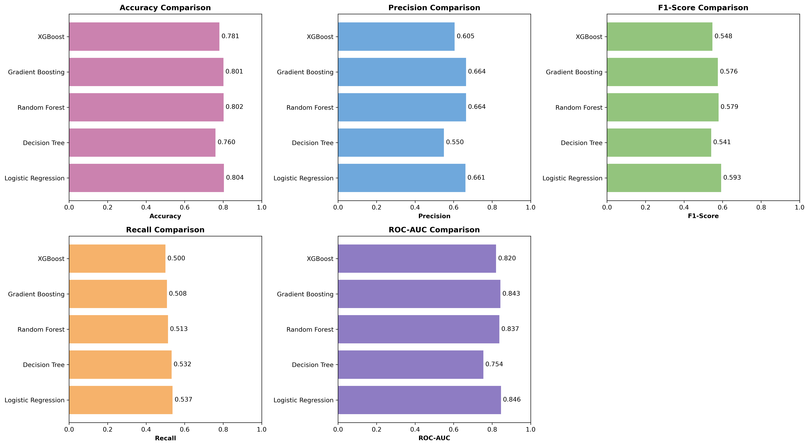
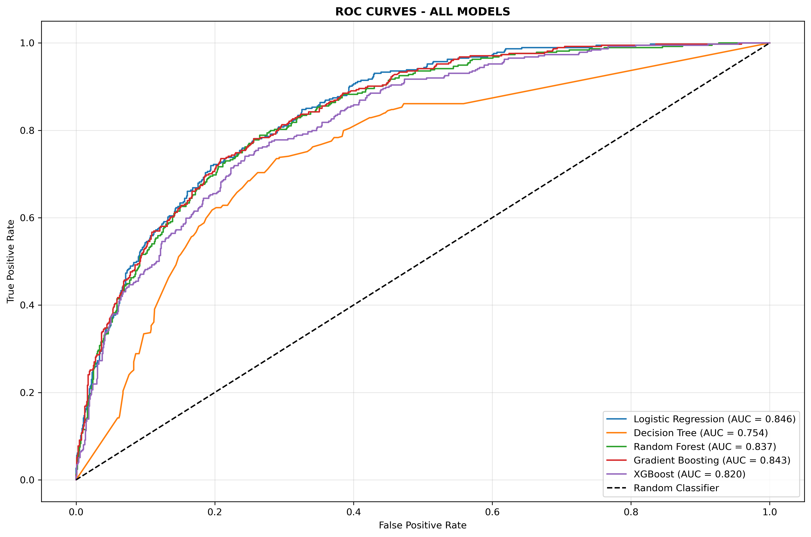

# Customer Churn Prediction App - End-to-End ML Pipeline


---

# 📋 Project Overview

A complete end-to-end machine learning pipeline to predict customer churn in the telecommunications industry.

This project demonstrates a real-world ML workflow including:

- Data exploration and analysis
- Data preprocessing
- Feature engineering
- Model training and comparison
- Model evaluation
- Model serialization
- Deployment-ready prediction application using Streamlit

## Business Problem

Customer churn directly impacts business revenue. By identifying customers who are likely to leave, companies can take proactive retention actions such as personalized offers, improved customer support, and loyalty programs.

---

# 🎯 Key Results

| Metric | Score |
|--------|------:|
| Best Model | Logistic Regression |
| ROC-AUC Score | 0.8458 |
| Accuracy | 80.41% |
| F1 Score | 0.5929 |

The final model provides a balance between identifying potential churn customers and maintaining prediction reliability.

---

# 📊 Dataset

**Dataset:** Telco Customer Churn Dataset

**Source:** IBM Watson Analytics / Kaggle

## Dataset Information

- **Customers:** 7,043
- **Features:** 20
- **Target Variable:** Churn (Yes/No)
- **Churn Rate:** Approximately 26.5%

---

# 📌 Features

## Demographic Information

- Gender
- Senior Citizen
- Partner
- Dependents

## Account Information

- Tenure
- Contract Type
- Payment Method
- Paperless Billing

## Service Information

- Phone Service
- Internet Service
- Online Security
- Online Backup
- Device Protection
- Tech Support
- Streaming Services

## Financial Information

- Monthly Charges
- Total Charges

---

# 🛠️ Tech Stack

## Programming Language

- Python 3.8+

## Machine Learning Libraries

- Scikit-learn
- XGBoost
- Imbalanced-learn

## Data Processing

- Pandas
- NumPy

## Visualization

- Matplotlib
- Seaborn

## Model Deployment

- Streamlit
- Joblib

---

# 🚀 Installation & Setup

## 1. Clone Repository

```bash
git clone https://github.com/princekds/Customer_Churn_Prediction_app.git

cd Customer_Churn_Prediction_app
```

---

## 2. Create Virtual Environment

### Windows

```bash
python -m venv churn.venv

churn.venv\Scripts\activate
```

### Linux / Mac

```bash
python -m venv churn.venv

source churn.venv/bin/activate
```

---

## 3. Install Dependencies

```bash
pip install -r requirements.txt
```

---

# 📂 Project Structure

```
Customer_Churn_Prediction_app/

│
├── data/
│   └── telco_customer_churn.csv
│
├── notebooks/
│   ├── 01_EDA.ipynb
│   └── 03_model_training.ipynb
│
├── src/
│   ├── data_preprocessing.py
│   ├── train_model.py
│   └── prediction.py
│
├── models/
│   └── churn_model.pkl
│
├── reports/
│   ├── model_comparison_graph.png
│   ├── roc_curves.png
│   └── confusion_matrix.png
│
├── app.py
├── requirements.txt
└── README.md
```

---

# 🔍 Machine Learning Workflow

## 1. Data Preprocessing

The following preprocessing steps were performed:

- Handled missing values in `TotalCharges`
- Cleaned and transformed raw data
- Converted categorical variables
- Applied feature encoding
- Scaled numerical features using StandardScaler

---

## Feature Engineering

Created additional features:

- `tenure_group`
- `avg_monthly_per_tenure`
- `num_services`

These features helped capture customer behavior patterns and improved model performance.

---

# 2. Model Training

Five machine learning algorithms were trained and evaluated:

1. Logistic Regression
2. Decision Tree
3. Random Forest
4. Gradient Boosting
5. XGBoost

---

# 3. Model Evaluation

Models were evaluated using:

- Accuracy
- Precision
- Recall
- F1 Score
- ROC-AUC Score

ROC-AUC was selected as the primary evaluation metric because churn datasets are typically imbalanced.

---

# 📈 Key Business Insights

## 1. Contract Type

Customers with month-to-month contracts have a significantly higher probability of churn compared with long-term contract customers.

## 2. Customer Tenure

Customers with shorter tenure are more likely to churn.

Early customer engagement plays an important role in retention.

## 3. Monthly Charges

Higher monthly charges are associated with increased churn risk.

## 4. Technical Support

Customers using technical support services show lower churn probability.

---

# 📊 Model Performance Visualization

## Model Comparison



## ROC Curves



## Confusion Matrix


---

# ▶️ Running the Application

Start the Streamlit application:

```bash
streamlit run app.py
```

The application allows users to enter customer information and receive churn predictions.

---

# 🔮 Future Improvements

- Hyperparameter optimization using GridSearchCV / RandomizedSearchCV
- Advanced class imbalance handling using SMOTE
- REST API deployment using FastAPI
- Automated ML pipeline with CI/CD
- Cloud deployment using AWS/Azure
- Model monitoring and automated retraining

---

# 📝 Lessons Learned

1. Feature engineering significantly improves machine learning performance.
2. Handling class imbalance is essential for churn prediction problems.
3. ROC-AUC is more meaningful than accuracy for imbalanced datasets.
4. Business understanding is important when selecting evaluation metrics.

---

# 👤 Author

**Prince Kaushik**

- GitHub: https://github.com/princekds
- Email: pkinsight.ds@gmail.com

---

# 📄 License

This project is licensed under the MIT License.

---

# 🙏 Acknowledgments

- IBM Watson Analytics for providing the Telco Customer Churn dataset
- Kaggle community for dataset availability
- Open-source Python Machine Learning ecosystem
